# PION Backend System


PION Backend is a robust and scalable administrative system built with **Laravel 12**. This system is designed to handle core business logic, user management, and various other operational integrations securely and efficiently.

## 🌟 Key Features

- **User Authentication & Authorization**: Managed securely with Laravel Sanctum.
- **Reporting & Exporting**: Generate documents easily using PDF (`dompdf`) and Excel (`maatwebsite/excel`).
- **Firebase Integration**: Seamless connectivity with Firebase for real-time capabilities or cloud functions.
- **Barcode Generation**: Built-in barcode generation capabilities (`milon/barcode`).
- **Modern Asset Bundling**: Fast compilation and HMR using Vite.

---

## 📸 Screenshots

Here is a quick look at the user interface and features available within the system:

### Overview
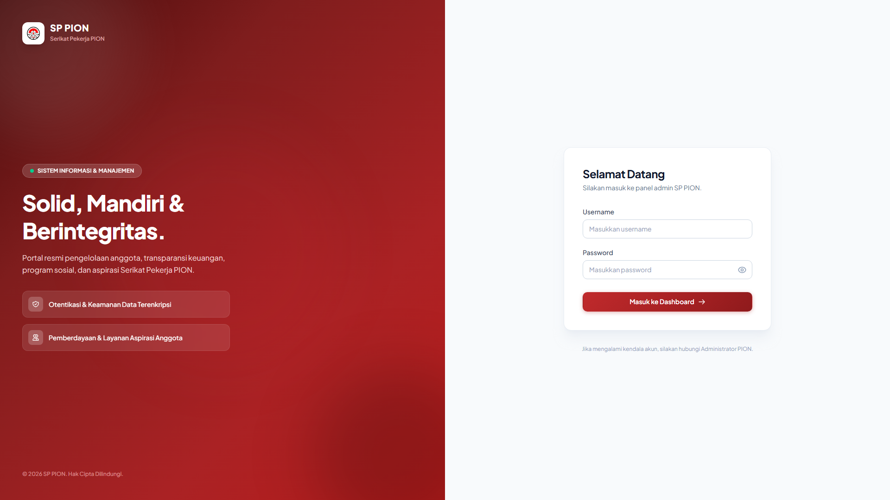
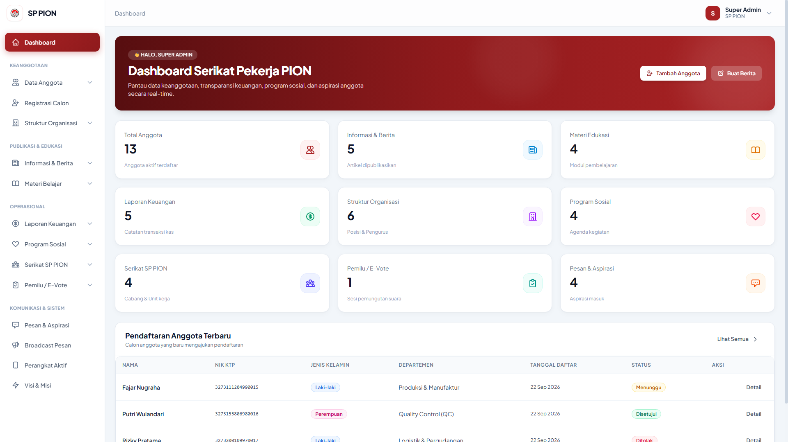
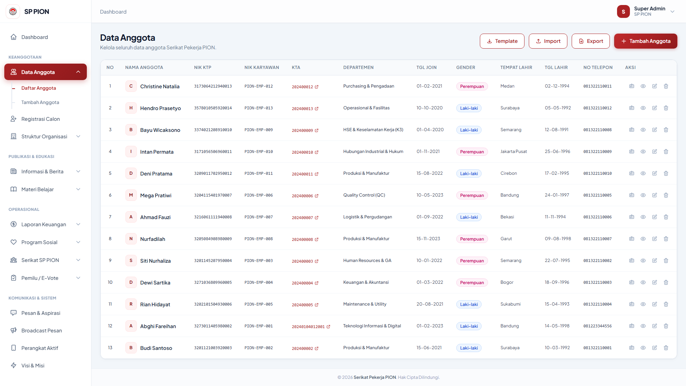
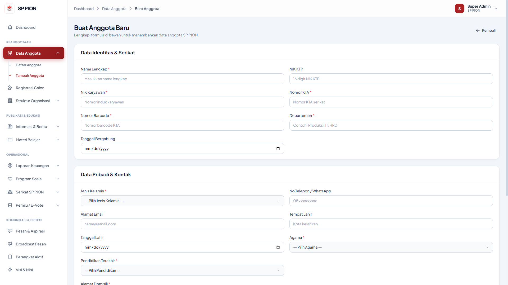
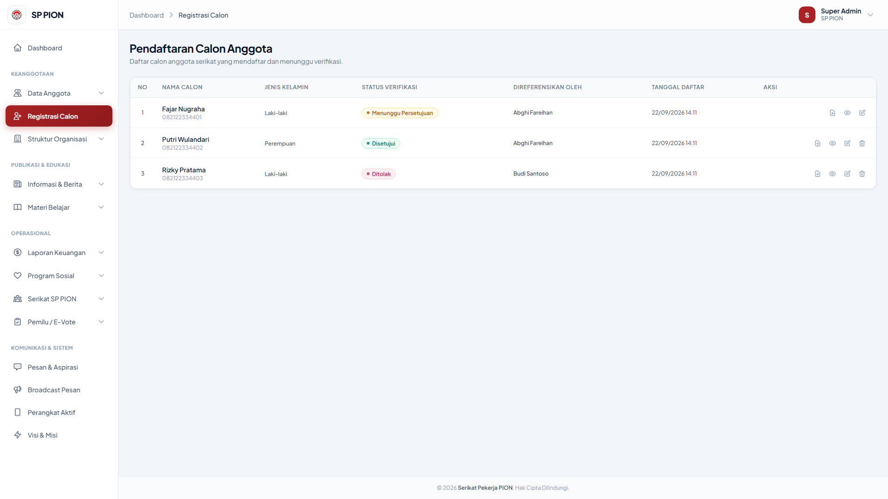
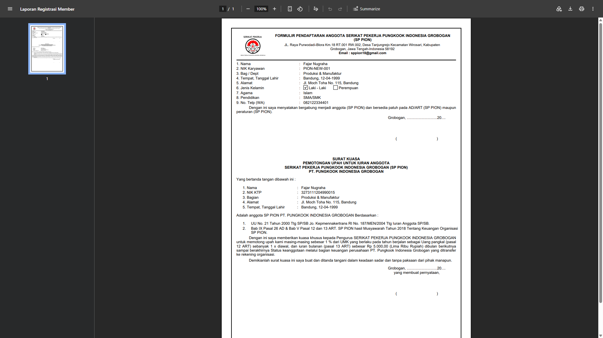
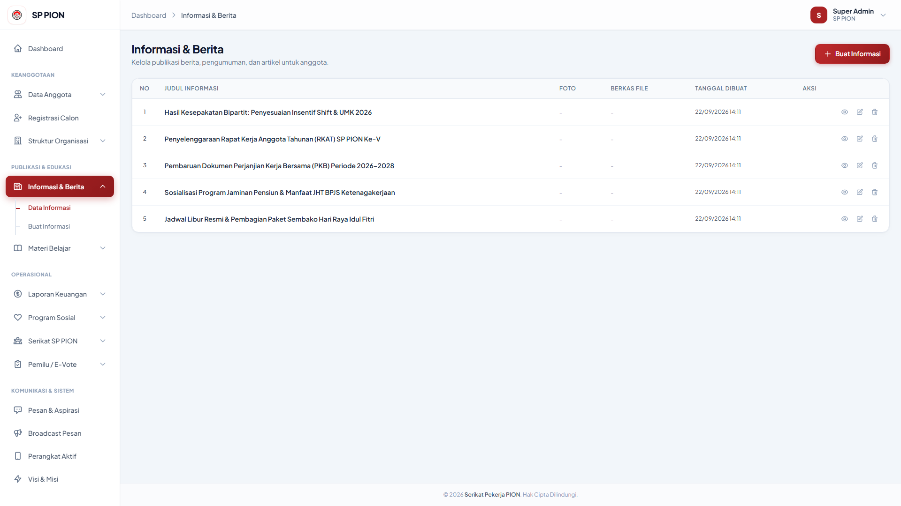
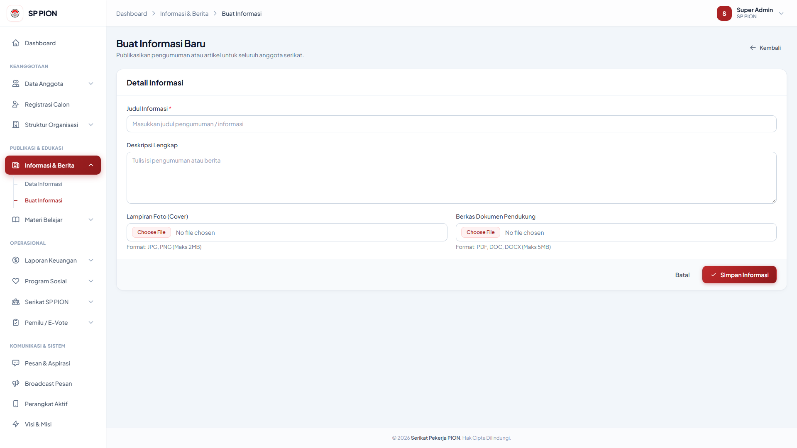
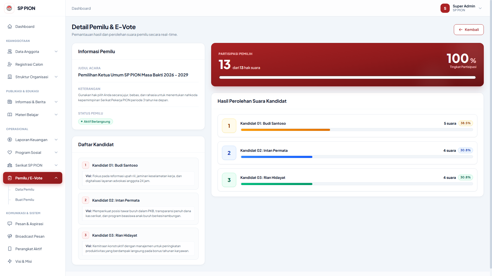
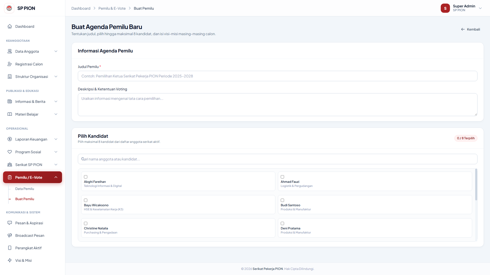
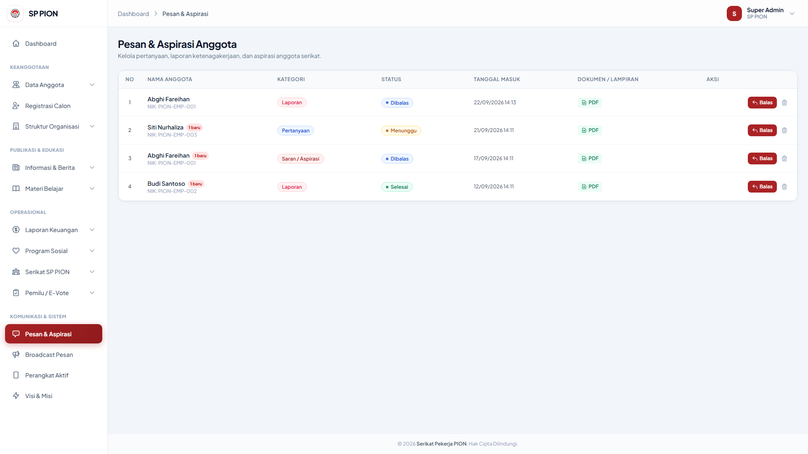
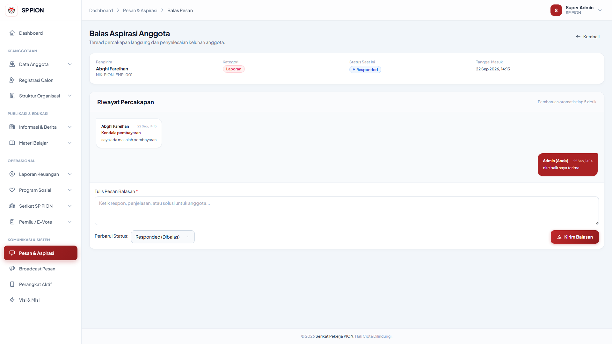

*(Note: You can update the titles above to better reflect the specific page shown in each screenshot)*

---

## 🚀 Getting Started

Follow these steps to get the project up and running on your local machine.

### Prerequisites
- **PHP** >= 8.2
- **Composer** 
- **Node.js** & **NPM**

### Installation

1. **Clone the repository:**
   ```bash
   git clone <your-repository-url>
   cd pion-backend
   ```

2. **Install PHP and Node.js dependencies:**
   ```bash
   composer setup
   ```
   *Note: The `setup` script is custom-defined in `composer.json` and automatically runs composer install, copies `.env`, generates key, migrates database, and installs/builds npm packages.*

3. **Configure Environment:**
   Open the newly generated `.env` file and set up your database credentials and other necessary API keys (like Firebase).
   ```env
   DB_CONNECTION=mysql
   DB_HOST=127.0.0.1
   DB_PORT=3306
   DB_DATABASE=pion_db
   DB_USERNAME=root
   DB_PASSWORD=
   ```

4. **Run the Development Server:**
   To run both the Laravel server and Vite in a single command, you can use:
   ```bash
   composer dev
   ```
   Alternatively, you can run them in separate terminals:
   ```bash
   php artisan serve
   npm run dev
   ```

## 📦 Core Dependencies

- [Laravel Framework v12.0](https://laravel.com/)
- [Laravel Sanctum v4.0](https://laravel.com/docs/sanctum)
- [Laravel DOMPDF v3.1](https://github.com/barryvdh/laravel-dompdf)
- [Maatwebsite Excel v3.1](https://docs.laravel-excel.com/)
- [Kreait Firebase v6.2](https://firebase-php.readthedocs.io/)

## 📝 License

This project is proprietary and confidential. Unauthorized copying of this project, via any medium, is strictly prohibited.
